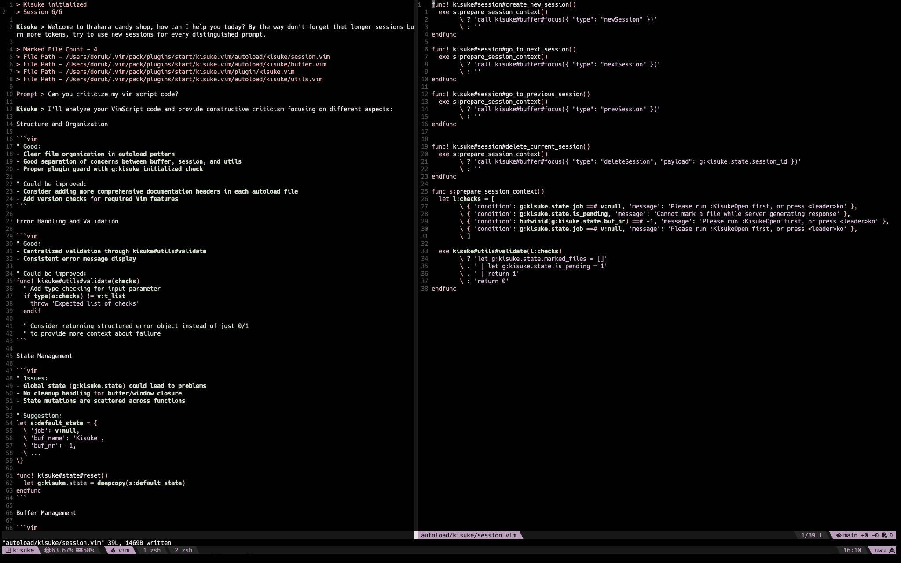

# kisuke.vim

A minimal AI assistant integration for Vim, inspired by modern AI-powered IDEs.



## About

Kisuke.vim is my first Vim plugin, born from a desire to learn plugin development and bring simple AI capabilities to Vim. While there are sophisticated alternatives available, this plugin aims to provide a straightforward AI integration focusing on simplicity and usability.

## Current Features

- 📝 Multi-session chat interface within Vim
- 📂 File context sharing (mark files to include in your prompts)
- 🤖 Claude AI integration for intelligent responses
- 💬 Simple buffer-based conversation UI
- 🔄 Session management (create, switch, delete)

## Planned Features

- ✨ Code snippet selection for context
- 🔌 Multiple AI model support:
  - OpenAI (ChatGPT)
  - Local models via Ollama
  - More to come
- 🛠️ Enhanced file context handling
- ⚙️ Configurable model settings
- 📚 More IDE-like features

## Installation

### Prerequisites

```bash
npm i -g yarn@latest
```

### Using Vim packages

```bash
mkdir -p ~/.vim/pack/plugins/start
cd ~/.vim/pack/plugins/start
git clone https://github.com/dorukozerr/kisuke.vim.git
cd kisuke.vim
yarn build
cd ~
```

Support for other plugin managers coming soon.

## Key Mappings

| Default Mapping                                                | Command                            | Description                               | Mode |
| :------------------------------------------------------------- | :--------------------------------- | :---------------------------------------- | :--- |
| <kbd>leader</kbd> + <kbd>k</kbd> + <kbd>o</kbd>                | `:KisukeOpen`                      | Open Kisuke chat buffer                   | `n`  |
| <kbd>leader</kbd> + <kbd>k</kbd> + <kbd>c</kbd>                | `:KisukeCreateNewSession`          | Create new session                        | `n`  |
| <kbd>leader</kbd> + <kbd>k</kbd> + <kbd>n</kbd>                | `:KisukeNextSession`               | Next session                              | `n`  |
| <kbd>leader</kbd> + <kbd>k</kbd> + <kbd>p</kbd>                | `:KisukePreviousSession`           | Previous session                          | `n`  |
| <kbd>leader</kbd> + <kbd>k</kbd> + <kbd>a</kbd>                | `:KisukeConfiguration`             | Configure API key                         | `n`  |
| <kbd>leader</kbd> + <kbd>k</kbd> + <kbd>d</kbd>                | `:KisukeDeleteSession`             | Delete current session                    | `n`  |
| <kbd>leader</kbd> + <kbd>k</kbd> + <kbd>m</kbd>                | `:KisukeMarkFocusedFile`           | Mark file for context                     | `n`  |
| <kbd>leader</kbd> + <kbd>k</kbd> + <kbd>h</kbd>                | `:KisukeMarkHighlighted`           | Mark highlighted code block for context   | `v`  |
| <kbd>leader</kbd> + <kbd>k</kbd> + <kbd>r</kbd> + <kbd>c</kbd> | `:KisukeRemoveLastMarkedCodeBlock` | Remove last added code block from context | `n`  |

## Current Status

This plugin is in active development, with new features being added regularly. While functional, it's still in its early stages and welcomes community feedback and contributions.

## Contributing

As this is a learning project, I'm open to suggestions, feedback, and contributions. Feel free to open issues or submit pull requests.

## License

MIT
